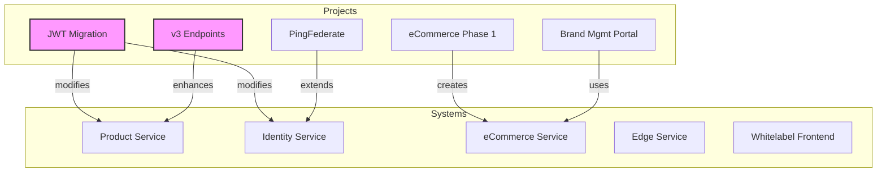

# SAGA Telecom Platform Portfolio

**Last Updated**: 2025-07-31  
**Portfolio Manager**: Niclas Schumacher  
**Status**: Active Development

## Overview

This portfolio manages the development of a multi-tenant telecom platform comprising multiple **systems** (technical services), **product areas** (business capabilities), and **projects** (work initiatives).

📖 **[Terminology Guide](./TERMINOLOGY.md)** - Read this first to understand our naming conventions

## Quick Navigation

- [Systems Architecture](#systems-architecture)
- [Product Areas](#product-areas) 
- [Active Projects](#active-projects)
- [Project Dependencies](#project-dependencies)
- [Portfolio Health](#portfolio-health)

## Systems Architecture

Our platform consists of the following technical systems:

| System | Purpose | Status | Documentation |
|--------|---------|--------|---------------|
| **[Product Service](./systems/product-service.md)** | Core backend APIs, tenant management | 🟢 Live (v2), v3 in development | [Details](./systems/product-service.md) |
| **[Identity Service](./systems/identity-service.md)** | Authentication & authorization | 🟢 Live, enhancements planned | [Details](./systems/identity-service.md) |
| **[eCommerce Service](./systems/ecommerce-service.md)** | Commerce APIs, catalog, orders | 🟡 Early development | [Details](./systems/ecommerce-service.md) |
| **[Edge Service](./systems/edge-service.md)** | Multi-tenant BFF for Whitelabel brands | 🟢 Live (beta) | [Details](./systems/edge-service.md) |
| **[Eesy BFF](./systems/eesy-bff.md)** | Standalone BFF for Eesy | 🟢 Live | [Details](./systems/eesy-bff.md) |
| **[Whitelabel Frontend](./systems/whitelabel-frontend.md)** | Multi-tenant SvelteKit platform | 🟢 Live (beta) | [Details](./systems/whitelabel-frontend.md) |
| **[Brand Management System](./systems/brand-management-system.md)** | Partner administration portal | 🟡 PoC Phase | [Details](./systems/brand-management-system.md) |

## Product Areas

Business capabilities delivered to customers:

### 🛍️ Customer Experience
- **[Whitelabel eCare](./products/whitelabel-ecare.md)** - Self-service portal (Live: 3 brands)
- **[Whitelabel Open Pages](./products/whitelabel-openpages.md)** - Public content & marketing
- **[Whitelabel eCommerce](./products/whitelabel-ecommerce.md)** - Shopping experience

### 👔 Business Management
- **Brand Management Portal** - Self-service administration for brand partners

## Active Projects

Current development initiatives:

### 🚀 In Progress

| Project | Impact | Lead | Target |
|---------|--------|------|--------|
| **[eCare Feature Completion](./projects/ecare-feature-completion.md)** | Complete remaining eCare functionality | Niclas S. | Q2 2025 |
| **[v3 Tenant Endpoints](./projects/v3-tenant-endpoints.md)** | Modernize Product Service APIs | Niclas S. | Q2-Q3 2025 |
| **[JWT Authentication Migration](./projects/jwt-authentication-migration.md)** | Replace BrandCookie with JWT | Niclas S. | Q1-Q3 2025 |
| **[Brand Management Portal PoC](./projects/brand-management-portal-poc.md)** | Blazor UI prototype for Brand Management System | Niclas S. | Q1 2025 |

### 📅 Starting Soon

| Project | Impact | Lead | Target |
|---------|--------|------|--------|
| **[PingFederate Integration](./projects/pingfederate-integration.md)** | Enterprise SSO for employees | Niclas S. | Q2 2025 |
| **[eCommerce Phase 1](./projects/ecommerce-phase1.md)** | Product catalog APIs | Niclas S. | Q2 2025 |
| **[Brand Configuration API](./projects/brand-configuration-api.md)** | Centralize tenant config in Product Service | Niclas S. | Q2-Q3 2025 |

### 🔮 Planned

| Project | Impact | Dependencies |
|---------|--------|--------------|
| **[Open Pages Launch](./projects/openpages-launch.md)** | Enable CMS-driven content | eCommerce Phase 1 |
| **[eCommerce Frontend](./projects/ecommerce-frontend.md)** | Shopping experience | eCommerce Service |

## Project Dependencies

## Portfolio Health

### Overall Status
- **Active Projects**: 7
- **Systems Health**: 4/5 operational
- **Resource Utilization**: 85%
- **Risk Level**: Medium

### Key Metrics
| Metric | Current | Target | Status |
|--------|---------|--------|--------|
| Platform Availability | 99.2% | 99.9% | ⚠️ |
| Active Brands | 3 | 10+ | 🔄 |
| Onboarding Time | 2-3 days | <30 min | 🎯 |
| API Response Time | 180ms | <100ms | 🔄 |

## Quick Links

- [Dependency Matrix](./documentation/dependency-matrix.md)
- [Resource Planning](./documentation/resource-planning.md)
- [Risk Register](./documentation/risk-register.md)
- [Technical Architecture](./documentation/architecture.md)

---

*For questions about terminology, see our [Terminology Guide](./TERMINOLOGY.md)*