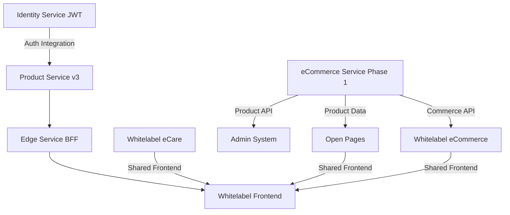

# Project Portfolio Overview

**Last Updated**: 2025-07-31  
**Portfolio Manager**: Niclas Schumacher  
**Status**: Active Portfolio Management

## Executive Summary

This portfolio encompasses multiple interconnected projects building a multi-tenant telecom platform. The portfolio includes frontend applications, backend services, and infrastructure components working together to deliver a complete white-label solution for telecom partners.

## Quick Navigation

- [Active Projects](#active-projects)
- [Project Dependencies](#project-dependencies)
- [Recommended Sequencing](#recommended-sequencing)
- [Portfolio Health](#portfolio-health)
- [Quick Links](#quick-links)

## Active Projects

### 🟢 In Progress

1. **[Whitelabel eCare](./projects/whitelabel-ecare/README.md)**
   - Status: Beta Live (3 brands)
   - Priority: High
   - Next Milestone: Complete frontend functionality

2. **[Identity Service - JWT Implementation](./projects/identity-service/README.md)**
   - Status: Development
   - Priority: High
   - Next Milestone: PasswordFlow implementation

### 🟡 Starting Soon

3. **[eCommerce Service - Phase 1](./projects/ecommerce-service/README.md)**
   - Status: Early Stage
   - Priority: Critical (blocks Open Pages)
   - Next Milestone: Product catalog API

4. **[Open Pages](./projects/open-pages/README.md)**
   - Status: Planning
   - Priority: Medium
   - Dependency: eCommerce Phase 1

### 🔵 Not Started

5. **[Whitelabel eCommerce Frontend](./projects/whitelabel-ecommerce/README.md)**
   - Status: Not Started
   - Priority: Medium
   - Dependency: eCommerce Service

## Project Dependencies

## Recommended Sequencing

### Phase 1: Foundation (Current)
1. ✅ Complete Identity Service JWT implementation
2. ✅ Finish Whitelabel eCare remaining functionality
3. ✅ Launch eCommerce Service Phase 1 (Product Catalog)

### Phase 2: Expansion (Next)
1. ⏳ Complete Admin System for brand partners
2. ⏳ Launch Open Pages with Contentful
3. ⏳ Begin Whitelabel eCommerce frontend

### Phase 3: Integration
1. ⏸️ Full eCommerce flow implementation
2. ⏸️ Cross-service integrations
3. ⏸️ Performance optimization

## Portfolio Health

| Metric | Status | Trend |
|--------|--------|-------|
| Overall Progress | 35% | ↗️ |
| Resource Utilization | 85% | → |
| Risk Level | Medium | ↗️ |
| Dependencies Blocked | 2 | ↘️ |

## Quick Links

- [Dependency Matrix](./documentation/dependency-matrix.md)
- [Resource Allocation](./documentation/resource-allocation.md)
- [Risk Register](./documentation/risk-register.md)
- [Status Reports](./status-reports/)
- [Architecture Overview](./documentation/architecture-overview.md)

---

*For detailed project information, click on individual project links above.*