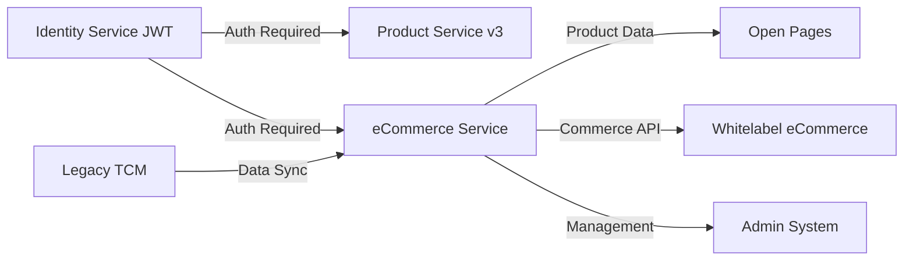

# Project Dependency Matrix

**Last Updated**: 2025-07-31  
**Status**: Active Management

## Dependency Overview

This matrix shows the relationships between projects in the portfolio, highlighting blocking dependencies and integration points.

## Dependency Matrix

| Project | Depends On | Blocks | Integration Type | Risk Level |
|---------|------------|--------|------------------|------------|
| **Whitelabel eCare** | Identity Service, Product Service | None | API, Frontend | Low |
| **Identity Service JWT** | None | All Frontend Projects, Product Service v3 | Authentication | High |
| **eCommerce Service Phase 1** | Identity Service, Legacy TCM | Open Pages, Whitelabel eCommerce | API, Data Sync | Critical |
| **Open Pages** | eCommerce Service Phase 1, Contentful | None | API, CMS | High |
| **Whitelabel eCommerce** | eCommerce Service (Full), Identity Service | None | API, Frontend | Medium |
| **Admin System** | eCommerce Service, Identity Service | Brand Partner Operations | Embedded, API | Medium |

## Critical Path Analysis

## Blocking Dependencies

### 🔴 Critical Blockers

1. **eCommerce Service Phase 1 → Open Pages**
   - Impact: Open Pages cannot display products without catalog API
   - Mitigation: Fast-track Phase 1 development
   - Resolution Date: Target Q2 2025

2. **Identity Service JWT → All Frontends**
   - Impact: Authentication migration affects all user-facing systems
   - Mitigation: Phased rollout with backwards compatibility
   - Resolution Date: Target Q1 2025

### 🟡 Medium Priority Dependencies

3. **eCommerce Service → Admin System**
   - Impact: Brand partners cannot manage products
   - Mitigation: Manual processes during transition
   - Resolution Date: Target Q2 2025

## Integration Points

### Service-to-Service Integrations

| From Service | To Service | Protocol | Authentication | Status |
|--------------|------------|----------|----------------|---------|
| All Services | Identity Service | REST/OAuth2 | OAuth2 | Active |
| Whitelabel Frontend | Edge Service | GraphQL | JWT | Beta |
| Edge Service | Product Service | REST | Service Token | Active |
| eCommerce Service | Legacy TCM | REST/Batch | API Key | Planned |
| Open Pages | eCommerce Service | REST | JWT | Pending |

### Data Dependencies

| Data Type | Source | Consumers | Sync Method | Frequency |
|-----------|--------|-----------|-------------|-----------|
| Product Catalog | Legacy TCM | eCommerce Service | Batch ETL | Daily |
| Customer Data | Product Service | All Services | API | Real-time |
| Auth Tokens | Identity Service | All Services | API | Real-time |
| Content | Contentful | Open Pages | API | Real-time |

## Risk Mitigation Strategies

### High-Risk Dependencies

1. **Legacy System Integration**
   - Risk: TCM system instability or API limitations
   - Mitigation: Build abstraction layer with caching
   - Contingency: Direct database access if needed

2. **Authentication Migration**
   - Risk: User disruption during transition
   - Mitigation: Dual-auth period with gradual migration
   - Contingency: Rollback capability maintained

3. **Cross-Service Data Consistency**
   - Risk: Data sync issues between services
   - Mitigation: Event-driven architecture with retry logic
   - Contingency: Manual reconciliation processes

## Dependency Resolution Timeline

| Quarter | Dependencies to Resolve | Impact |
|---------|------------------------|---------|
| Q1 2025 | Identity Service JWT implementation | Unblocks all auth integrations |
| Q2 2025 | eCommerce Service Phase 1 | Unblocks Open Pages, Admin System |
| Q3 2025 | Full eCommerce integration | Enables complete commerce flow |
| Q4 2025 | All dependencies resolved | Full platform operational |

## Monitoring & Tracking

- Weekly dependency review meetings
- Automated integration testing between services
- Dependency health dashboard
- Escalation process for blocked items

---

[← Back to Portfolio Overview](../README.md)