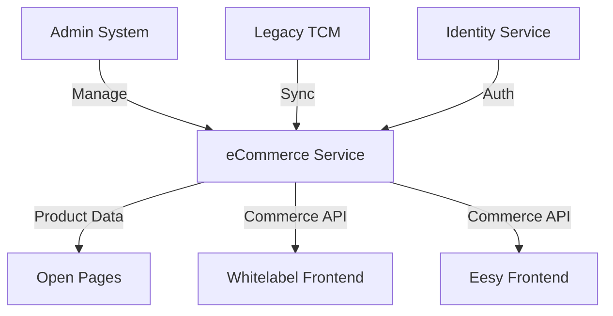

# eCommerce Service Project

**Status**: 🟡 Early Stage  
**Priority**: Critical (Blocks Open Pages)  
**Project Lead**: Niclas Schumacher  
**Start Date**: January 2025  
**Target Phase 1**: Q2 2025

## Overview

The eCommerce Service project delivers the core commerce capabilities for the multi-tenant platform. Phase 1 focuses on product catalog management and APIs to enable website product display. This service is critical as it blocks the Open Pages project and enables the full eCommerce experience.

## Project Phases

### Phase 1: Product Catalog & Display (Current Focus)
- Product catalog API
- Multi-tenant product management
- Channel-specific product visibility
- Basic pricing and availability

### Phase 2: Shopping & Checkout
- Shopping cart functionality
- Order management
- Payment integration
- MSISDN reservation

### Phase 3: Full Commerce
- Subscription lifecycle
- Recurring billing
- Promotions and campaigns
- Advanced analytics

## Current State

### Completed
- ✅ Initial architecture design
- ✅ Technology stack selection
- ✅ Development environment setup

### In Progress
- 🔄 Core service scaffolding
- 🔄 Database schema design
- 🔄 Admin system planning (Blazor)

### Pending
- ⏳ Product catalog API implementation
- ⏳ Multi-tenant data isolation
- ⏳ Integration with existing systems
- ⏳ Admin portal development

## Key Components

| Component | Status | Owner | Notes |
|-----------|--------|-------|-------|
| Core Service | 🔄 20% | Backend Team | .NET 9 foundation |
| Product Catalog API | ⏳ Not Started | Backend Team | First priority |
| Admin System | ⏳ Not Started | Full-stack Team | Blazor-based |
| Database Layer | 🔄 30% | Backend Team | Schema design phase |
| Integration Layer | ⏳ Not Started | Integration Team | TCM/Legacy systems |

## Dependencies

### Upstream Dependencies
- Identity Service (for service auth)
- Legacy TCM system (for product data)

### Downstream Dependencies
- Open Pages (waiting for product data)
- Whitelabel eCommerce Frontend
- Eesy Frontend (self-implementation)
- Admin System

## Integration Architecture

## Risks & Issues

| Risk/Issue | Impact | Mitigation | Status |
|------------|--------|------------|---------|
| Legacy system integration complexity | High | POC planned | Active |
| Multi-tenant data isolation | High | Architecture review | In Progress |
| Open Pages timeline pressure | High | Phase 1 prioritization | Monitored |
| Resource availability | Medium | Cross-team collaboration | Planning |

## Phase 1 Deliverables

1. **Product Catalog API**
   - CRUD operations for products
   - Multi-tenant isolation
   - Channel-based filtering

2. **Admin Portal (MVP)**
   - Product management UI
   - Brand configuration
   - Basic reporting

3. **Integration Points**
   - Legacy system sync
   - API gateway configuration
   - Authentication integration

## Success Metrics

### Phase 1 Metrics
- **API Performance**: <200ms response time
- **Catalog Size**: Support 10,000+ products
- **Tenant Isolation**: Zero cross-tenant data leaks
- **Admin Efficiency**: 80% reduction in product setup time

## Resources

- [Architecture Design](./docs/architecture.md)
- [API Specification](./docs/api-spec.md)
- [Database Schema](./docs/database-schema.md)
- [Integration Guide](./docs/integration-guide.md)

## Contact

- **Slack Channel**: #ecommerce-service
- **Technical Lead**: TBD
- **Product Owner**: TBD

---

[← Back to Portfolio Overview](../../README.md)