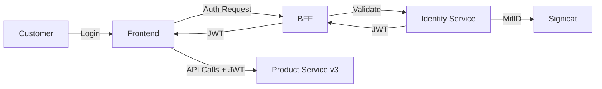

# Identity Service - JWT Implementation Project

**Status**: 🟢 In Progress  
**Priority**: High  
**Project Lead**: Niclas Schumacher  
**Start Date**: TBD  
**Target Completion**: Q1 2025

## Overview

The Identity Service project implements OAuth2-based authentication across all services, with current focus on implementing PasswordFlow for JWT-based customer authentication. This replaces the legacy BrandCookie management in Product Service and enables modern, secure authentication across the platform.

## Current State

### Completed
- ✅ OAuth2 service-to-service authentication
- ✅ MitID integration via Signicat
- ✅ Basic identity service infrastructure

### In Progress
- 🔄 PasswordFlow implementation for customer JWT
- 🔄 Product Service v3 tenant endpoints integration
- 🔄 BFF alignment (Eesy and Whitelabel)

### Pending
- ⏳ Frontend integration for JWT handling
- ⏳ Legacy BrandCookie deprecation
- ⏳ Multi-factor authentication options

## Key Components

| Component | Status | Owner | Notes |
|-----------|--------|-------|-------|
| Identity Service Core | ✅ Complete | Platform Team | OAuth2 ready |
| PasswordFlow | 🔄 60% | Security Team | Core logic implemented |
| Product Service v3 Integration | 🔄 40% | Backend Team | Tenant endpoints WIP |
| BFF Updates | ⏳ Not Started | Backend Team | Awaiting JWT spec |
| Frontend Updates | ⏳ Not Started | Frontend Team | Dependency on BFF |

## Dependencies

### Upstream Dependencies
- MitID/Signicat service availability
- Security architecture approval

### Downstream Dependencies
- Product Service v3 tenant endpoints
- All BFF services (Edge-service, Eesy)
- All frontend applications

## Risks & Issues

| Risk/Issue | Impact | Mitigation | Status |
|------------|--------|------------|---------|
| Breaking change for frontends | High | Phased rollout plan | Planning |
| Session migration complexity | High | Dual-auth period | Approved |
| Performance impact | Medium | Caching strategy | In Design |
| Third-party provider reliability | Low | Fallback mechanisms | Implemented |

## Integration Points

## Milestones

- [x] Core OAuth2 Implementation - Completed
- [x] MitID Integration - Completed
- [ ] PasswordFlow Complete - Target: February 2025
- [ ] Product Service v3 Integration - Target: March 2025
- [ ] BFF Updates - Target: March 2025
- [ ] Frontend Migration - Target: April 2025
- [ ] Legacy Deprecation - Target: June 2025

## Success Metrics

- **Security**: Zero auth-related incidents
- **Performance**: <100ms token validation
- **Adoption**: 100% services using JWT
- **User Experience**: Seamless migration

## Migration Strategy

1. **Phase 1**: Dual authentication support
2. **Phase 2**: New customers on JWT only
3. **Phase 3**: Migrate existing customers
4. **Phase 4**: Deprecate BrandCookie

## Resources

- [JWT Specification](./docs/jwt-spec.md)
- [Integration Guide](./docs/integration-guide.md)
- [Security Architecture](./docs/security-architecture.md)
- [Migration Playbook](./docs/migration-playbook.md)

## Contact

- **Slack Channel**: #identity-service
- **Security Lead**: TBD
- **Technical Lead**: TBD

---

[← Back to Portfolio Overview](../../README.md)