# Whitelabel eCommerce Project

**Status**: 🔵 Not Started  
**Priority**: Medium  
**Project Lead**: Niclas Schumacher  
**Start Date**: Q3 2025  
**Target Completion**: Q4 2025

## Overview

The Whitelabel eCommerce project delivers the complete online shopping experience for telecom products and subscriptions. This is the third and final pillar of the white-label platform, enabling customers to browse, configure, and purchase mobile subscriptions, broadband services, and related products.

## Current State

### Completed
- ✅ High-level requirements gathering
- ✅ Architecture alignment with platform

### In Progress
- 🔄 Detailed requirements analysis
- 🔄 UX/UI design concepts

### Pending
- ⏳ Frontend component development
- ⏳ Shopping cart implementation
- ⏳ Checkout flow with MSISDN selection
- ⏳ Payment integration (frontend)
- ⏳ Order confirmation and tracking

## Key Components

| Component | Status | Owner | Notes |
|-----------|--------|-------|-------|
| Product Catalog UI | ⏳ Not Started | Frontend Team | Depends on eCommerce Service |
| Shopping Cart | ⏳ Not Started | Frontend Team | Complex state management |
| MSISDN Selection | ⏳ Not Started | Frontend Team | Telecom-specific |
| Checkout Flow | ⏳ Not Started | Frontend Team | Multi-step process |
| Payment UI | ⏳ Not Started | Frontend Team | PCI compliance needed |
| Order Management | ⏳ Not Started | Frontend Team | Post-purchase experience |

## Dependencies

### Upstream Dependencies
- **eCommerce Service** (Full implementation required)
- **Identity Service**: Customer authentication
- **Payment Service**: Payment processing
- **Number Management Service**: MSISDN availability
- **Whitelabel Frontend**: Shared components and framework

### Downstream Dependencies
- None (end-user facing)

## User Journey

```mermaid
graph LR
    A[Browse Products] -->|Select| B[Configure Product]
    B -->|Add to Cart| C[Shopping Cart]
    C -->|Checkout| D[MSISDN Selection]
    D -->|Continue| E[Customer Details]
    E -->|Payment| F[Payment Processing]
    F -->|Confirm| G[Order Confirmation]
    G -->|Track| H[Order Status]
```

## Telecom-Specific Features

1. **MSISDN Management**
   - Number selection/reservation
   - Port-in eligibility check
   - Golden number options

2. **SIM Card Options**
   - Physical SIM delivery
   - eSIM activation
   - Multi-SIM support

3. **Subscription Configuration**
   - Data packages
   - Add-ons and features
   - Family/group plans

4. **Compliance**
   - Age verification
   - Identity verification
   - Regulatory requirements

## Risks & Issues

| Risk/Issue | Impact | Mitigation | Status |
|------------|--------|------------|---------|
| Backend service delays | Critical | Cannot start without APIs | Monitoring |
| Complex telecom requirements | High | Early stakeholder involvement | Planning |
| Payment integration complexity | High | Partner with payment team | Not Started |
| Multi-brand customization | Medium | Flexible theming system | In Design |

## Technical Requirements

### Frontend Stack
- **Framework**: SvelteKit (aligned with platform)
- **State Management**: Svelte stores + Context
- **Styling**: Tailwind CSS with brand theming
- **Forms**: SvelteKit forms with validation
- **Testing**: Vitest + Playwright

### Integration Points
- REST APIs for backend services
- WebSocket for real-time updates
- Payment gateway SDKs
- Analytics integration

## Milestones

- [ ] Design Approval - Target: June 2025
- [ ] Component Development Start - Target: July 2025
- [ ] Shopping Cart Complete - Target: August 2025
- [ ] Checkout Flow Complete - Target: September 2025
- [ ] Payment Integration - Target: October 2025
- [ ] First Brand Launch - Target: November 2025
- [ ] Full Production Release - Target: December 2025

## Success Metrics

- **Conversion Rate**: >3% visitor to purchase
- **Cart Abandonment**: <60%
- **Checkout Time**: <5 minutes average
- **Mobile Experience**: 100% responsive
- **Error Rate**: <0.1% transaction failures

## Resources

- [UI/UX Designs](./docs/designs/)
- [Component Specifications](./docs/components/)
- [Integration Guide](./docs/integration-guide.md)
- [Testing Strategy](./docs/testing-strategy.md)

## Contact

- **Slack Channel**: #whitelabel-ecommerce
- **Technical Lead**: Niclas Schumacher
- **UX Lead**: TBD
- **Product Owner**: TBD

---

[← Back to Portfolio Overview](../../../README.md) | [← Back to Whitelabel Projects](../README.md)