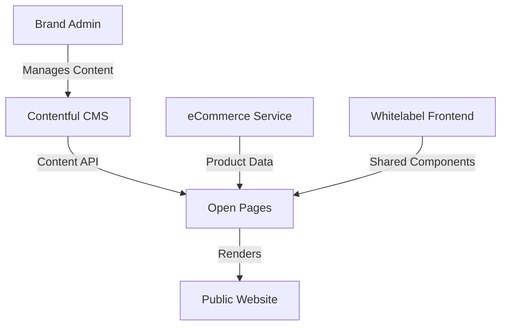

# Whitelabel Open Pages Project

**Status**: 🟡 Starting Soon  
**Priority**: Medium  
**Project Lead**: Niclas Schumacher  
**Start Date**: Q2 2025  
**Target Completion**: Q3 2025

## Overview

The Open Pages project delivers the public-facing content management capabilities for the white-label platform. Built on Contentful CMS, this pillar enables brand partners to manage their public websites, marketing content, and product displays without technical involvement.

## Current State

### Completed
- ✅ Contentful CMS selection and setup
- ✅ Initial component design
- ✅ Architecture planning

### In Progress
- 🔄 Component library development
- 🔄 Contentful integration design

### Pending
- ⏳ Product display components (blocked by eCommerce Phase 1)
- ⏳ Full component library
- ⏳ Brand customization framework
- ⏳ SEO optimization

## Key Components

| Component | Status | Owner | Notes |
|-----------|--------|-------|-------|
| Contentful Integration | 🔄 30% | Frontend Team | Base integration ready |
| Component Library | 🔄 20% | Frontend Team | Need more designs |
| Product Display | ⏳ Blocked | Frontend Team | Waiting for eCommerce API |
| Brand Theming | ⏳ Not Started | Frontend Team | Design system needed |
| SEO Framework | ⏳ Not Started | Frontend Team | Technical SEO setup |

## Dependencies

### Upstream Dependencies
- **eCommerce Service Phase 1** (Critical): Need product catalog API
- **Whitelabel Frontend**: Shared component library
- **Contentful**: CMS availability and configuration

### Downstream Dependencies
- None (end-user facing)

## Architecture

## Risks & Issues

| Risk/Issue | Impact | Mitigation | Status |
|------------|--------|------------|---------|
| eCommerce API delay | High | Mock data for development | Active |
| Component standardization | Medium | Design system documentation | Planning |
| Performance with dynamic content | Medium | Caching strategy | In Design |
| SEO complexity | Low | Early SEO consultation | Planned |

## Content Types

1. **Marketing Pages**
   - Landing pages
   - Product category pages
   - Campaign pages

2. **Product Displays**
   - Product listings
   - Product details
   - Pricing displays

3. **Informational**
   - Help/FAQ
   - Terms & Conditions
   - Contact pages

## Milestones

- [x] Contentful Setup - Completed
- [x] Architecture Design - Completed
- [ ] Component Library (Phase 1) - Target: April 2025
- [ ] eCommerce Integration - Target: May 2025
- [ ] First Brand Launch - Target: June 2025
- [ ] Full Production Release - Target: July 2025

## Success Metrics

- **Page Load Time**: <2s for content pages
- **Content Management**: <5 min to publish changes
- **SEO Performance**: Top 10 for brand keywords
- **Component Reuse**: 80% component standardization

## Technical Stack

- **Frontend**: SvelteKit (shared with platform)
- **CMS**: Contentful
- **Styling**: Tailwind CSS with brand theming
- **Performance**: CDN + Edge caching
- **Analytics**: Google Analytics 4

## Resources

- [Component Library Docs](./docs/component-library.md)
- [Contentful Schema](./docs/contentful-schema.md)
- [Brand Theming Guide](./docs/brand-theming.md)
- [SEO Guidelines](./docs/seo-guidelines.md)

## Contact

- **Slack Channel**: #whitelabel-open-pages
- **Technical Lead**: Niclas Schumacher
- **Design Lead**: TBD

---

[← Back to Portfolio Overview](../../../README.md) | [← Back to Whitelabel Projects](../README.md)