# SAGA eCommerce Platform Architecture Diagrams

This document contains Mermaid diagrams showing the current system architecture and the projected completed system for the SAGA eCommerce multi-tenant telecom platform.

## Current System Architecture (Phase 1 - 75% Complete)

The current implementation shows our foundation layer with basic multi-tenant infrastructure, API framework, and development tools in place.

```mermaid
graph TB
    subgraph "Current Implementation (Phase 1 - 75% Complete)"
        subgraph "Infrastructure Layer"
            AppHost["🚀 AppHost<br/>(Aspire Orchestration)"]
            ServiceDefaults["⚙️ ServiceDefaults<br/>(Observability)"]
            SQL["🗄️ SQL Server<br/>(Multi-Tenant DB)"]
        end
        
        subgraph "API Layer"
            API["🌐 API<br/>(FastEndpoints)<br/>✅ Complete"]
            Auth["🔐 Multi-Tenant Auth<br/>(Finbuckle)<br/>🚧 In Progress"]
        end
        
        subgraph "Shared Components"
            SharedDomain["📦 Shared.Domain<br/>✅ Complete"]
            SharedInfra["🔧 Shared.Infrastructure<br/>✅ Complete"]
        end
        
        subgraph "Modules (Skeleton)"
            CatalogMod["📊 Catalog Module<br/>🚧 Basic Structure"]
            ChannelMod["📺 Channel Module<br/>🚧 Basic Structure"]
            TenantMod["🏢 Tenant Module<br/>📋 Planned"]
        end
        
        subgraph "Development Tools"
            EditorConfig["📝 .editorconfig<br/>✅ Complete"]
            GitHubTemplates["📋 GitHub Templates<br/>✅ Complete"]
            CICD["🔄 CI/CD Pipeline<br/>📋 Ready"]
        end
    end
    
    %% Connections
    AppHost --> API
    AppHost --> SQL
    API --> Auth
    API --> CatalogMod
    API --> ChannelMod
    CatalogMod --> SharedDomain
    CatalogMod --> SharedInfra
    ChannelMod --> SharedDomain
    ChannelMod --> SharedInfra
    Auth --> SQL
    
    %% Status Colors
    classDef complete fill:#d4edda,stroke:#155724,stroke-width:2px
    classDef inProgress fill:#fff3cd,stroke:#856404,stroke-width:2px
    classDef ready fill:#cce7ff,stroke:#004085,stroke-width:2px
    classDef planned fill:#f8d7da,stroke:#721c24,stroke-width:2px
    
    class AppHost,API,SharedDomain,SharedInfra,EditorConfig,GitHubTemplates complete
    class Auth,CatalogMod,ChannelMod inProgress
    class CICD ready
    class TenantMod planned
```

### Current State Summary
- **✅ Completed (6/8 tasks)**: Foundation infrastructure, API framework, development tools
- **🚧 In Progress (2/8 tasks)**: Multi-tenant authentication, database integration
- **📋 Ready**: CI/CD pipeline implementation
- **🎯 Focus**: Completing multi-tenant infrastructure foundation

---

## Projected Completed System (Phase 2 Complete)

The projected system shows the full multi-tenant telecom eCommerce platform with all business modules, external integrations, and production-ready features.

```mermaid
graph TB
    subgraph "Completed SAGA eCommerce Platform (Phase 2 Complete)"
        subgraph "External Systems"
            TCM["🏢 TCM Legacy<br/>(Customer Management)"]
            PaymentGW["💳 Payment Gateways<br/>(Adyen, Stripe)"]
            ExtTenant["🏢 External Tenant<br/>Management"]
        end
        
        subgraph "Frontend Layer"
            SvelteKit["🎨 SvelteKit Frontend<br/>(Whitelabel)"]
            Contentful["📄 Contentful CMS<br/>(Content Management)"]
        end
        
        subgraph "Infrastructure Layer"
            AppHost["🚀 AppHost<br/>(Aspire Orchestration)"]
            ServiceDefaults["⚙️ ServiceDefaults<br/>(Observability)"]
            SQL["🗄️ SQL Server<br/>(Multi-Tenant DB)"]
            Redis["🔄 Redis<br/>(Caching)"]
            MessageBus["📬 Message Bus<br/>(Inter-Module Comm)"]
        end
        
        subgraph "API Gateway"
            API["🌐 API Gateway<br/>(FastEndpoints)"]
            Auth["🔐 Multi-Tenant Auth<br/>(Finbuckle)"]
            RateLimit["⚡ Rate Limiting"]
            Monitoring["📊 Monitoring"]
        end
        
        subgraph "Core Business Modules"
            Catalog["📊 Product Catalog<br/>• Products & Categories<br/>• Search & Discovery<br/>• Telecom Products"]
            Channel["📺 Channel Management<br/>• Channel Config<br/>• Visibility Rules<br/>• Open Pages"]
            Basket["🛒 Shopping Basket<br/>• Cart Management<br/>• MSISDN Reservation<br/>• Validation"]
            Order["📋 Order Management<br/>• Order Lifecycle<br/>• Saga Orchestration<br/>• Status Tracking"]
            Payment["💳 Payment Processing<br/>• Multi-Gateway<br/>• Payment Methods<br/>• Fraud Detection"]
            NumberMgmt["📞 Number Management<br/>• MSISDN Lifecycle<br/>• Number Portability<br/>• SIM Management"]
        end
        
        subgraph "Shared Components"
            SharedDomain["📦 Shared.Domain<br/>• Base Entities<br/>• Value Objects<br/>• Domain Events"]
            SharedInfra["🔧 Shared.Infrastructure<br/>• Multi-Tenant Base<br/>• Common Services<br/>• Event Bus"]
            SharedApp["🔗 Shared.Application<br/>• CQRS Patterns<br/>• Validation<br/>• Mapping"]
        end
        
        subgraph "Data Layer"
            CatalogDB[("📊 Catalog Data<br/>(Tenant Isolated)")]
            ChannelDB[("📺 Channel Data<br/>(Tenant Isolated)")]
            BasketDB[("🛒 Basket Data<br/>(Tenant Isolated)")]
            OrderDB[("📋 Order Data<br/>(Tenant Isolated)")]
            PaymentDB[("💳 Payment Data<br/>(Tenant Isolated)")]
            NumberDB[("📞 Number Data<br/>(Tenant Isolated)")]
        end
    end
    
    %% External Connections
    SvelteKit --> API
    SvelteKit --> Contentful
    API --> TCM
    Payment --> PaymentGW
    Auth --> ExtTenant
    
    %% API Gateway Connections
    API --> Auth
    API --> RateLimit
    API --> Monitoring
    
    %% Module Connections
    API --> Catalog
    API --> Channel
    API --> Basket
    API --> Order
    API --> Payment
    API --> NumberMgmt
    
    %% Shared Component Connections
    Catalog --> SharedDomain
    Catalog --> SharedInfra
    Catalog --> SharedApp
    Channel --> SharedDomain
    Channel --> SharedInfra
    Channel --> SharedApp
    Basket --> SharedDomain
    Basket --> SharedInfra
    Basket --> SharedApp
    Order --> SharedDomain
    Order --> SharedInfra
    Order --> SharedApp
    Payment --> SharedDomain
    Payment --> SharedInfra
    Payment --> SharedApp
    NumberMgmt --> SharedDomain
    NumberMgmt --> SharedInfra
    NumberMgmt --> SharedApp
    
    %% Infrastructure Connections
    AppHost --> API
    AppHost --> SQL
    AppHost --> Redis
    AppHost --> MessageBus
    Auth --> SQL
    
    %% Data Connections
    Catalog --> CatalogDB
    Channel --> ChannelDB
    Basket --> BasketDB
    Order --> OrderDB
    Payment --> PaymentDB
    NumberMgmt --> NumberDB
    CatalogDB --> SQL
    ChannelDB --> SQL
    BasketDB --> SQL
    OrderDB --> SQL
    PaymentDB --> SQL
    NumberDB --> SQL
    
    %% Inter-Module Communication
    Order -.-> MessageBus
    Payment -.-> MessageBus
    Basket -.-> MessageBus
    NumberMgmt -.-> MessageBus
    MessageBus -.-> Order
    MessageBus -.-> Payment
    MessageBus -.-> Basket
    MessageBus -.-> NumberMgmt
    
    %% Caching
    Catalog -.-> Redis
    Channel -.-> Redis
    NumberMgmt -.-> Redis
    
    %% Status Colors
    classDef module fill:#e1f5fe,stroke:#01579b,stroke-width:2px
    classDef infrastructure fill:#f3e5f5,stroke:#4a148c,stroke-width:2px
    classDef external fill:#fff8e1,stroke:#e65100,stroke-width:2px
    classDef data fill:#e8f5e8,stroke:#2e7d32,stroke-width:2px
    classDef shared fill:#fce4ec,stroke:#880e4f,stroke-width:2px
    
    class Catalog,Channel,Basket,Order,Payment,NumberMgmt module
    class AppHost,ServiceDefaults,SQL,Redis,MessageBus,API,Auth,RateLimit,Monitoring infrastructure
    class TCM,PaymentGW,ExtTenant,SvelteKit,Contentful external
    class CatalogDB,ChannelDB,BasketDB,OrderDB,PaymentDB,NumberDB data
    class SharedDomain,SharedInfra,SharedApp shared
```

### Projected Complete State Summary
- **🎯 Full Business Logic**: All 6 core modules (Catalog, Channel, Basket, Order, Payment, Number Management)
- **🔄 Advanced Architecture**: Inter-module communication via message bus for saga patterns
- **🌐 Frontend Integration**: SvelteKit whitelabel frontend with Contentful CMS
- **💳 Payment Processing**: Multi-gateway support (Adyen, Stripe) with fraud detection
- **📞 Telecom Features**: Complete MSISDN lifecycle, number portability, SIM management
- **🏢 External Integration**: TCM legacy system integration, external tenant management
- **⚡ Production Features**: Redis caching, rate limiting, comprehensive monitoring

---

## Key Differences and Evolution Path

### **Phase 1 (Current - 75% Complete)**
| Component | Status | Description |
|-----------|--------|-------------|
| **Infrastructure** | ✅ Complete | Aspire orchestration, SQL Server, basic setup |
| **API Framework** | ✅ Complete | FastEndpoints configured with health endpoints |
| **Multi-Tenant Auth** | 🚧 In Progress | Finbuckle integration being implemented |
| **Module Structure** | 🚧 Basic | Skeleton modules created, basic structure |
| **Development Tools** | ✅ Complete | .editorconfig, GitHub templates, documentation |

### **Phase 2 (Projected Complete)**
| Component | Status | Description |
|-----------|--------|-------------|
| **Business Modules** | 🎯 Target | 6 complete modules with full business logic |
| **Frontend** | 🎯 Target | SvelteKit whitelabel frontend with CMS |
| **External Integration** | 🎯 Target | TCM legacy, payment gateways, tenant management |
| **Performance** | 🎯 Target | Redis caching, rate limiting, monitoring |
| **Production Ready** | 🎯 Target | Full observability, security, scalability |

### **Architectural Principles Maintained**
- **Multi-Tenant First**: Tenant isolation at every layer using Finbuckle.MultiTenant
- **Modular Monolith**: Clean module boundaries with shared infrastructure
- **Domain-Driven Design**: Rich domain models with clear bounded contexts
- **CQRS/Event Sourcing**: Command/Query separation with domain events
- **Microservices Ready**: Modules can be extracted to separate services if needed
- **Telecom Focused**: Purpose-built for telecom eCommerce requirements

### **Technology Stack Evolution**
| Layer | Current | Projected Complete |
|-------|---------|-------------------|
| **Orchestration** | .NET Aspire | .NET Aspire + Kubernetes |
| **API** | FastEndpoints | FastEndpoints + Rate Limiting |
| **Authentication** | Basic Finbuckle | Complete multi-tenant auth + external integration |
| **Database** | SQL Server | SQL Server + Redis + Message Bus |
| **Frontend** | None | SvelteKit + Contentful CMS |
| **Monitoring** | Basic Aspire | Full observability stack |

---

## Business Value Progression

### **Current Value (Phase 1)**
- **Developer Productivity**: Fast local development setup
- **Code Quality**: Consistent standards and automated checks
- **Team Coordination**: Structured GitHub workflow
- **Technical Foundation**: Solid multi-tenant architecture base

### **Projected Value (Phase 2)**
- **Business Agility**: New tenant onboarding in 2-3 weeks (vs. months)
- **Market Expansion**: Support for multiple brand partners
- **Operational Efficiency**: Automated order processing and payment handling
- **Customer Experience**: Modern, fast, whitelabel storefronts
- **Revenue Growth**: Accelerated time-to-market for new telecom products

---

**Document Owner:** Architecture Team  
**Created:** 2025-07-13  
**Last Updated:** 2025-07-13  
**Review Schedule:** Updated at major milestones or architecture changes
