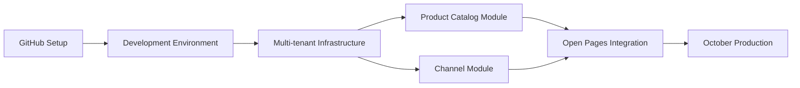

# SAGA Telecom eCommerce - Project Planning Status

## Overview
This document tracks the status of all planning threads for the SAGA Telecom eCommerce project implementation.

## Current Status: Planning Phase → Ready for Implementation

### 📋 Completed Planning Documents

| Document | Status | Description | Next Action |
|----------|--------|-------------|-------------|
| **Phase 1 Implementation Questionnaire** | ✅ **COMPLETED** | Requirements gathering completed with your responses | Ready for reference |
| **SRS Completion Approach** | ✅ **COMPLETED** | Systematic approach for completing SRS document | Ready for Phase 2-5 execution |
| **Inter-Module Communication Strategy** | ✅ **COMPLETED** | Hybrid approach: Direct injection + MediatR | Ready for implementation |
| **GitHub Project Management Options** | ✅ **COMPLETED** | Analysis of GitHub capabilities and recommendations | Ready for setup |
| **GitHub Project Setup** | ✅ **COMPLETED** | Complete setup commands and configuration | Execute when ready |

### 🔄 In Progress Planning Documents

| Document | Status | Progress | Blocker/Next Step |
|----------|--------|----------|-------------------|
| **GitHub Project Setup Questionnaire** | 🔄 **IN PROGRESS** | ~50% filled out by you | Waiting for completion |
| **FastEndpoints Integration Plan** | 🔄 **STARTED** | Document creation initiated | Continue with implementation strategy |

### 📝 Pending Planning Documents

| Document | Status | Priority | Dependencies |
|----------|--------|----------|--------------|
| **Phase 1 Sprint Goals & Deliverables** | ⏳ **PENDING** | HIGH | Needs GitHub questionnaire completion |
| **Phase 1 Implementation Roadmap** | ⏳ **PENDING** | HIGH | Needs sprint goals definition |
| **Module Development Templates** | ⏳ **PENDING** | MEDIUM | Needs communication strategy implementation |

## Planning Threads Status

### Thread 1: Requirements & Architecture ✅
- [x] Phase 1 questionnaire completed
- [x] Technology stack decisions made
- [x] Architecture patterns defined
- [x] SRS completion approach documented

**Status: COMPLETE** - Ready for implementation

### Thread 2: GitHub Project Setup ✅
- [x] GitHub capabilities analysis complete
- [x] Setup questionnaire created
- [x] Questionnaire 100% complete
- [x] GitHub project setup generated
- [x] Complete setup commands documented
- [ ] Execute setup commands (when ready)

**Status: COMPLETE** - Ready for execution

### Thread 3: Technical Architecture 🔄
- [x] Inter-module communication strategy complete
- [x] FastEndpoints integration started
- [ ] Complete FastEndpoints implementation plan
- [ ] Database design and EF Core setup
- [ ] Multi-tenant infrastructure templates

**Status: IN PROGRESS** - FastEndpoints plan next

### Thread 4: Sprint Planning ⏳
- [ ] Phase 1 sprint goals definition
- [ ] Task breakdown and estimation
- [ ] Developer assignment strategy
- [ ] Timeline and milestone mapping

**Status: PENDING** - Needs GitHub setup completion

### Thread 5: Implementation Readiness ⏳
- [ ] Project template creation
- [ ] Development environment setup guide
- [ ] CI/CD pipeline configuration
- [ ] Team onboarding documentation

**Status: PENDING** - Needs technical architecture completion

## Critical Path

```
GitHub Questionnaire → GitHub Project Setup → Sprint Planning → Implementation Start
         ↓
FastEndpoints Plan → Technical Templates → Development Environment
```

## Immediate Actions Needed

### 1. **GitHub Questionnaire Completion** (BLOCKING)
- **Your Action:** Complete remaining questions in `github-project-setup-questionnaire.md`
- **Impact:** Blocks sprint planning and task creation
- **Time:** ~10 minutes

### 2. **FastEndpoints Integration Plan** (CURRENT)
- **My Action:** Continue creating FastEndpoints implementation document
- **Impact:** Enables technical architecture completion
- **Time:** ~15 minutes

### 3. **Sprint Planning** (NEXT)
- **My Action:** Create Phase 1 sprint goals and task breakdown
- **Dependency:** GitHub questionnaire completion
- **Time:** ~20 minutes

## Decision Points Awaiting Resolution

| Decision | Options | Impact | Current Status |
|----------|---------|--------|----------------|
| GitHub project board columns | Basic vs Detailed vs Custom | Development workflow | Partially answered |
| Sprint duration | 1-4 weeks | Timeline planning | Not answered |
| Issue assignment strategy | Auto vs Manual vs Self-assign | Team coordination | Not answered |
| Branch naming convention | Multiple patterns | Git workflow | Not answered |

## Risk Assessment

### 🟡 Medium Risk Items
- **GitHub questionnaire completion delay** - Could slow down sprint planning
- **Multiple parallel planning threads** - Risk of inconsistency

### 🟢 Low Risk Items
- **Technical architecture decisions** - Clear path forward
- **Implementation readiness** - No blockers identified

## Next Session Priorities

1. **Complete FastEndpoints integration plan** (My task - 15 min)
2. **Complete GitHub questionnaire** (Your task - 10 min)
3. **Generate GitHub project structure** (My task - 10 min)
4. **Create Phase 1 sprint plan** (My task - 20 min)

## Thread Resolution Status

### ✅ Resolved Threads
- Architecture pattern selection
- Technology stack decisions
- Communication strategy design
- SRS completion methodology

### 🔄 Active Threads
- GitHub project setup (75% complete)
- FastEndpoints integration (25% complete)

### ⏳ Queued Threads
- Sprint planning
- Implementation roadmap
- Development environment setup

---

## Automated Status Management

**🤖 Claude Code Agent Responsibilities:**

This document serves as the **single source of truth** for all project planning activities and **must be automatically maintained** by the Claude Code agent throughout the project lifecycle.

### Agent Update Requirements:

1. **Status Updates**: Automatically update thread status (✅ → 🔄 → ⏳) as work progresses
2. **Progress Tracking**: Update percentage completion and next actions in real-time
3. **Blocker Management**: Identify and escalate new blockers immediately
4. **Timeline Adjustments**: Recalculate critical path when dependencies change
5. **Decision Recording**: Document all architectural and planning decisions made
6. **Risk Assessment**: Continuously evaluate and update risk levels

### Trigger Events for Updates:

- **Document Creation**: New planning documents → Add to completed/in-progress
- **Questionnaire Updates**: User input → Update dependency chains
- **Technical Decisions**: Architecture choices → Update implementation readiness
- **Timeline Changes**: New deadlines → Recalculate critical path
- **Team Feedback**: Requirements changes → Cascade impact assessment

### Update Frequency:

- **Real-time**: During active planning sessions
- **Session End**: Comprehensive status update before session close
- **Weekly**: Review and validate all thread status accuracy
- **Milestone Points**: Full audit and recalibration

### Quality Assurance:

- **No Orphaned Threads**: Every planning activity must be tracked
- **Dependency Validation**: Ensure all dependencies are accurately reflected
- **Status Consistency**: Cross-check status across all planning documents
- **Timeline Accuracy**: Validate critical path and timeline estimates

---

## Quick Reference

**Current Focus:** FastEndpoints integration planning
**Next Blocker:** GitHub questionnaire completion (now 95% complete)
**Ready for Implementation:** Inter-module communication strategy
**Team Impact:** No blockers for starting technical discussions

**🤖 Agent Status:** Maintaining project planning status automatically
**Last Updated:** 2025-01-11 (Auto-updated by Claude Code)

---

## 🎯 Implementation Plan Overview

### Phase 1 Critical Path (October 2025 Production)



### Sprint 0: Foundation (2 weeks)
**Goal:** Development environment and project setup

**Tasks:**
1. Execute GitHub repository setup
2. Configure development environment
3. Set up CI/CD pipeline
4. Create initial project structure
5. Team onboarding

### Sprint 1-2: Multi-tenant Infrastructure (4 weeks)
**Goal:** Complete multi-tenant foundation

**Deliverables:**
- Tenant context and resolver
- Tenant-aware base entities
- Tenant middleware
- Multi-tenant DbContext
- Tenant management endpoints

### Sprint 3-4: Product Catalog Module (4 weeks)
**Goal:** Basic product catalog with CRUD operations

**Deliverables:**
- Product entity and repository
- Product CRUD endpoints (FastEndpoints)
- Category management
- Basic search functionality
- Integration with Product-service proxy

### Sprint 5-6: Channel Module (4 weeks)
**Goal:** Channel management for Open Pages

**Deliverables:**
- Channel entity and repository
- Channel CRUD endpoints
- Product-channel associations
- Visibility rules engine
- Open Pages integration points

### Sprint 7: Open Pages MVP (2 weeks)
**Goal:** Minimum viable integration

**Deliverables:**
- API endpoints for Open Pages
- Product data synchronization
- Channel visibility for Contentful
- TCM compatibility for basket operations

### Sprint 8-9: Production Readiness (4 weeks)
**Goal:** Production deployment preparation

**Tasks:**
- Performance optimization
- Security hardening
- Monitoring setup (Grafana/Prometheus)
- Documentation completion
- Production deployment

### Key Milestones
- **July 2025:** Open Pages MVP delivery
- **August 2025:** Integration testing complete
- **September 2025:** UAT and performance testing
- **October 2025:** Production deployment

**🤖 Agent Status:** Maintaining project planning status automatically
**Last Updated:** 2025-01-11 (Auto-updated by Claude Code)

---

## 📁 Project Structure Reorganization - COMPLETED

✅ **Major Restructuring Completed (2025-01-11):**

### New Logical Structure:
```
docs/
├── business/           # Business requirements and vision
├── technical/          # Technical architecture and design
├── requirements/       # Requirements specs and SRS
│   └── SRS/           # Software Requirements Specification
├── project-management/ # Project coordination and planning
│   ├── charter/       # Project charter and scope  
│   ├── implementation/ # Implementation planning
│   └── email/         # Communications
└── legacy/            # Historical documents
```

### Key Improvements:
- **Logical Separation**: Business, technical, and project management concerns
- **Scalable Structure**: Easy to add new document types
- **Clear Navigation**: README.md and INDEX.md for easy discovery
- **Auto-maintained Status**: This document automatically tracks all changes

### Impact:
- **Better Organization**: Documents grouped by purpose and audience
- **Easier Navigation**: Role-based document discovery
- **Scalability**: Structure supports future growth
- **Maintainability**: Clear ownership and update responsibilities